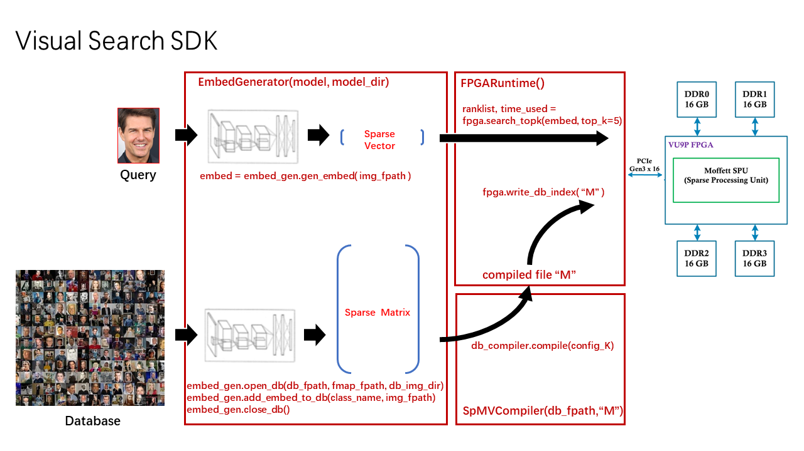

# User Guide for Moffett Visual Search SDK DEMO Version 

## Table of Contents
1. [SDK Introduction](#Intro)
2. [Import APIs and Setup Visual Search SDK](#Setup)
3. [APIs Introduction](#APIs)
4. [Visual Search Demo Introduction](#Demo)
5. [Example: Adding Image to Database](#addImg2DB)
6. [Example: Compiling Database Embeddings](#Compile)
7. [Example: Launch FPGA and Processing Queries](#LaunchRun)

 
<a name="Intro"></a>

## SDK Introduction
The visual search SDK is delivered in python APIs. The APIs includes three major tools: 
* Embedding generator
* Database compiler 
* FPGA runtime



Embedding generator provides two main functions: 
* Given a image, generate the corresponding sparse embedding. 
* Given a image, add its corresponding sparse embedding into the database.

Database compiler compiles a database file into binary files (file "M") that can be processed by the FPGA.

FPGA runtime provides two main functions:
* Database loading: Loading compiled database embeddings (file "M") into FPGA after launching a FPGA.
* Query searching: Loading query embeddings into FPGA, return a parsed ranklist from FPGA and FPGA processing time.


#### SDK Library File Structure and Example Code
```
    ├── sdk/
    │   ├── setup_fpga.sh
    │   ├── setup_vsearch.sh
    │   ├── vsearch_demo.py
    │   ├── vsearch_demo_compile.py
    │   ├── vsearch_demo_add_img_to_db.py
    │   ├── vsearch_demo_clean_img.py    
    │   ├── Makefile
    │   ├── libs/
    │   │   ├── setup_vs_sdk.sh     
    │   │   ├── fpga_runtime/
    │   │   │   ├── fpga_runtime.so
    │   │   ├── compiler/
    │   │   │   ├── compiler.so
    │   │   │   ├── vs.compiler
    │   │   ├── embed_gen/
    │   │   │   ├── embed_gen.so
    │   │   │   ├── imagenet_preprocessing.so
    │   │   │   ├── input_pipeline.so
    │   │   │   ├── mobilefacenet.so
    │   │   │   ├── mobilenet/
    │   │   ├── utils/
    │   │   │   ├── vs_clean_img.so
```
#### Model and Database File Structure
The visual search demo SDK works with the visual search database which consists of three elements:
* Image database: a directory where all image files are stored
* Database embedding file: stores corresponding sparse embeddings of the image files
* Database file map: records the corresponding image class name and file name for each embedding in the database embedding file
```
    ├── vsearch_sdk_demo/
    │   ├── sdk/
    │   ├── <db_image_dir>/
    │   │   ├── identity_0001
    │   │   │   ├── img_0001.jpg
    │   │   │   ├── img_0002.jpg
    │   │   │   ├── img_0003.jpg
    │   │   │            …
    │   │   ├── identity_0002
    │   │             …
    │   ├── embeddings/
    │   │   ├── mscele1m/
    │   │   │   ├── mscele1m_embed_bin.txt
    │   │   │   ├── msceleb_sparse_1024.hdf5.filemap
    │   ├── embeddings_backup/
    │   ├── model/
    │   │   ├── msceleb_vsearch_model/
    │   ├── compiled_db_embed/
    
```
NOTE: Image file is stored as <db_image_dir>/class_name/file_name

<a name="Setup"></a>

## Import APIs and Setup Visual Search SDK
#### Recommendation for Enviornment:
* OS: CentOS Linux 7
* Python3: 3.6.8
* Tensorflow: 1.14.0
* Numpy: 1.15.3

#### Import of APIs in Python
Add the following lines to your python program to include the SDK library path:
```
    import os
    import sys
    sys.path.append(os.environ['VS_LIB_DIR'])
```
Then any of the APIs can be imported as a python module to your python program on demand:
```
    # import embedding generator
    from embed_gen.embed_gen import EmbedGenerator
    
    # import database compiler
    from compiler.compiler import SpMVCompiler
    
    # import FPGA runtime
    from fpga_runtime.fpga_runtime import FPGARuntime
```
Add the following line to your python program to surpress some tensorflow warnings when using the embedding generator API.
```
    os.environ['TF_CPP_MIN_LOG_LEVEL'] = '3' 
```

#### SDK setup

The SDK API library is located in directory [`sdk/libs/`](sdk/libs/)

Before running any python program that calls APIs from the SDK, setup the SDK by sourcing script [`sdk/libs/setup_vs_sdk.sh`](sdk/libs/setup_vs_sdk.sh).

NOTE: The above script need to be sourced everytime launching a new terminal.

You can put the sdk library `libs/` to your project directory, and run the following command in terminal or add it to your setup script/python program to setup the SDK.
```
    source <LIB_LOCATION>/libs/setup_vs_sdk.sh
```
<LIB_LOCATION> is where you place the `libs/`.  <LIB_LOCATION> can be a relative path or an absolute path, depending on where you execute your python program.

After sourcing the script, you can check if the SDK is set up by following command:
```
   echo $VS_LIB_DIR
```
If the path returned is the path of the sdk library, the SDK is successfully set up.

<a name="APIs"></a>

## APIs Introduction
#### Embedding Generator
Embedding generator provides two main functions: 
* given a image, generate the corresponding sparse embedding. 
* given a image, add its corresponding sparse embedding into the database.

The sparse embedding is generated using a selected model network. Output of embedding generator is a sparse vector.
Following is an example of launch the embedding generator with selected model:
```
    from embed_gen.embed_gen import EmbedGenerator
    embed_gen = EmbedGenerator(model, model_dir)
```
Parameters:
* model (str): 
```
    name of model network selected
```
* model_dir (str): 
```
    directory of model network selected
```
The SDK provides a model network for visual search: 
* model_name = face
* model_dir = vsearch_demo/model/msceleb_vsearch_model

##### Usage： Generating Sparse Embedding from a Query
Following is an example usage for generating sparse embedding from a query
```
    query_embed = embed_gen.gen_embed(query_img_fpath)
```
Parameters:
* query_img_fpath (str)
```
    file path of the query image
```
Output:
* query_embed (list, default=['index', 'value']): 
```
    image embedding sparse vector
```
##### Usage： Add an Image to Database
By invoking the function of adding images to database: 
* the image files will be copied to the image database
* the generated image embeddings will be add to the top of the database embedding file
* the parsed image class name and file name will be added to the database file map

Following is an example usage for adding a image to database. 
```
    embed_gen.open_db(db_embed_fpath, db_filemap_fpath, db_img_dir) 
    embed_gen.add_embed_to_db(img_class_name, img_dir)
    embed_gen.close_db()
```
Parameters for open_db:
* db_embed_fpath (str)
```
    file path of database embedding
```
* db_filemap_fpath (str)
```
    file path of database filemap
```
* db_img_dir (str)
```
   database directory where all image files are stored
```
Parameters for add_embed_to_db:
* img_class_name (str)
```
   name for a class of images provided by user, in visual search, the class name can be a person's name or an identity index. 
   The image file will be stored in db_img_dir/img_class_name/img_file_name
```
`NOTE: Please use only alphabets, number and '_' for the class name, space is not allowed in class name`
* img_dir (str)
```
   directory or file path of the image to be added to the database. 
   If a directory path is put here, all images in the directory will be added to the database. Import sub-directories of this directory is not supported in this version.
```
`NOTE: Please use only alphabets, number and '_' for the image file name and directory name, space is not allowed.`

After processing an image file or a directory, the database needs to be closed by db_close() and opened again by db_open() before processing another set of images.

##### Format of Database Embedding File
The database embedding file consists of a header and a large number of image embeddings, the format in database embeddings file is shown as follow:
```
    header :      K C d2s_threshold
    embedding 0 : nnz index:value index:value index:value index:value... 
    embedding 1 : nnz index:value index:value index:value index:value... 
    embedding 2 : nnz index:value index:value index:value index:value... 
    ...
```
* K: number of embeddings in this database (database size)
* C: dimension of image embedding
* d2s_threshold: default threshold for dense to sparse operation in FPGA (not used)
* nnz: number of non-zero value in this embedding. No greater than C

One database embedding file that contains 1 million face image embeddings is provided in the SDK:
* db_embed_fpath = ../embeddings/mscele1m/mscele1m_embed_bin.txt
* K = 1048576
* C = 1024

##### Format of Database File Map
To obtain the corresponding image file path for the top-k results in the ranklist, an additional database filemap is required, which records the image name corresponding to each image embedding.
An example format of the filemap is shown as follow: 
```
    embedding 0 : class_name image_file_name
    embedding 1 : class_name image_file_name
    embedding 2 : class_name image_file_name
    embedding 3 : class_name image_file_name
    ...
```
The image file path in database can be represent as:
```
    db_image_dir/class_name/image_file_name
```
The order of information recorded in filemap is kept consistent to the embedding indexing order in the database embedding file.

A corresponding filemap example for the 1 million image database is provided in the SDK: 
* db_filemap_fpath = ../embeddings/mscele1m/msceleb_sparse_1024.hdf5.filemap

#### Database Compiler 
Database compiler compiles a database file into binary files (file "M") that can be processed by the FPGA.
Following is an example usage of the database compiler:
```
    from compiler.compiler import SpMVCompiler
    db_compiler = SpMVCompiler(db_embed_fpath, db_compiled_embed_dir)
    db_compiler.compile(config_K)
```
Parameters:
* db_embed_fpath (str): 
```
    file path of database embedding file
```
* db_compiled_embed_dir (str): 
```
    directory where compiled binary files will be stored
```
* config_K (int or 'None', default=None): 
```
    user configuration K that specifies first K embeddings of database will be compiled. No larger than the actual database size. Set to 'None' for compiling the whole database.
```

#### FPGA Runtime
FPGA runtime library provides two main tools:
(1) Database loading tool: Loading compiled database embeddings (file "M") into FPGA DDR after launching the FPGA
(2) Query processing tool: Loading query embeddings into FPGA, return a parsed ranklist and FPGA processing time

##### Usage: Database Loading
Following is an example of loading compiled database embeddings into FPGA:
```
    from fpga_runtime.fpga_runtime import FPGARuntime
    fpga_runtime = FPGARuntime()
    fpga_runtime.write_db_index(db_compiled_embed_dir)
```
Parameters: 
* db_compiled_embed_dir (str): 
```
    directory of compiled database binary file (file "M")
```

##### Usage: Query searching
Following is an example of processing a query embedding by invoking FPGA SPU:
```
    ranklist, time_used = fpga_runtime.search_topk(query_embed, top_k)
```
Parameters:  
* query_embed (list, default=['index', 'value']): 
```
    query image embedding generated from embedding generator
```
* top_k (int, default=5): 
```
    number of result to be returned that has the highest scores searched through database 
```

Output:
* time_used (float): 
```
    FPGA processing time in ms
```
* ranklist (list, default=['embedding_idx', (float(score) + embedding_idx * 1e-8)]): 
```
    a list of top k result returned, including the embedding index and score value
```
<a name="Demo"></a>
## Visual Search Demo Introduction
The Moffett visual search demo is implemented by the APIs provided in the SDK. The demo presents three basic functions:

* add images to database, or clean added images from database.
* compile modified database.
* launch FPGA with compiled database and process image search queries.


Following is the basic flow for running the demo example code:

(1) Setup Demo

Switch to directory `vsearch_sdk_demo/sdk/`, run following command in terminal to setup the SDK:
```
    $ source setup_vsearch.sh
```
You can check if the SDK is set up successfully by following command:
```
    $ echo $VS_LIB_DIR
```
If the path returned is the path of the sdk library `vsearch_sdk_demo/sdk/libs`, the SDK is successfully set up.

(2) Compile the database, launch FPGA with compiled database and process queries:
```
    $ make vs_compile
    $ make vs_run
```
(3) Add images to database, compile the database again, launch FPGA with compiled database and process queries:
```
    $ make vs_add_img class=[image_class_name]
    $ make vs_compile
    $ make vs_run
```
(4) Clean the added images, compile the database again, launch FPGA with compiled database and process queries:
```
    $ make vs_clean_img
    $ make vs_compile
    $ make vs_run
```

More details of the three demo function mentioned above and the steps of running each example is described in the following three sections.

<a name="addImg2DB"></a>

## Example: Adding Image to Database

#### Setup Demo
Switch to directory `vsearch_sdk_demo/sdk/`, run following command in terminal to setup the SDK:
```
    $ source setup_vsearch.sh
```
You can check if the SDK is set up successfully by following command:
```
    $ echo $VS_LIB_DIR
```
If the path returned is the path of the sdk library `vsearch_sdk_demo/sdk/libs`, the SDK is successfully set up.

#### Run Demo
An example code is provided in [vsearch_sdk_demo/sdk/vsearch_demo_add_img_to_db.py](sdk/vsearch_demo_add_img_to_db.py)

Parameters can be modified in [vsearch_sdk_demo/sdk/Makefile](sdk/Makefile):
```
vs_add_img:
    python3  vsearch_demo_add_img_to_db.py ${DB_IMG_DIR} ${DB_EMBED} ${DB_FMAP} ${MODEL} ${MODEL_DIR} ${ADD_IMG_DIR} ${class}
```
* `DB_IMG_DIR`,`DB_EMBED`,`DB_FMAP` : selected database
* `MODEL`,`MODEL_DIR` : selected model
* `ADD_IMG_DIR`: directory or file path of the image(s) to be added

`NOTE: Please use only alphabets, number and '_' for the image directory name, space is not allowed.`

Run following command in `vsearch_sdk_demo/sdk/` to run the example:
```
    $ make vs_add_img class=[image_class_name]
```
`NOTE: Please use only alphabets, number and '_' for the class name, space is not allowed.`

result of running the example with `ADD_IMG_DIR` = ../user_image/queries and `class` = class01

```
    $ make vs_add_img class=class01

    [Moffett VS Log]
    load model network...
    start adding images to database: static/mscele1m/images/user_img/class01
    number of image files to be added to database: 7
    ../user_image/queries/01.png is added to database
    ../user_image/queries/02.png is added to database
    ../user_image/queries/03.png is added to database
    ../user_image/queries/04.png is added to database
    ../user_image/queries/05.png is added to database
    ../user_image/queries/06.png is added to database
    ../user_image/queries/07.png is added to database

```

You can run following command in `vsearch_sdk_demo/sdk/` to cleanup the images that has been added to database:
```
   $ make vs_clean_img
```
This command will reset the database to initial state.

After any modification is made in the database, such as adding images to database or reseting database, the database need to be compiled again before launching the FPGA. Follow next section to compile the database.

<a name="Compile"></a>

## Example: Compiling Database Embeddings
There are two cases in which the database need to be compiled with SpMVCompiler called:

(1) Database is uncompiled and to be loaded to FPGA for the first time.

(2) Modification is made in the database: (a) new image(s) added to database. (b) database has been reset by `make vs_clean_img`

#### Setup Demo
Switch to directory `vsearch_sdk_demo/sdk/`, run following command in terminal to setup the SDK:
```
    $ source setup_vsearch.sh
```
You can check if the SDK is set up successfully by following command:
```
    $ echo $VS_LIB_DIR
```
If the path returned is the path of the sdk library `vsearch_sdk_demo/sdk/libs`, the SDK is successfully set up.

#### Run Demo
An example code is provided in [vsearch_sdk_demo/sdk/vsearch_demo_compile.py](sdk/vsearch_demo_compile.py)

Parameters can be modified in [vsearch_sdk_demo/sdk/Makefile](sdk/Makefile):
```
vs_compile:
	python3  vsearch_demo_compile.py ${DB_EMBED} ${DB_COMPILED_DIR} ${k}
```
* `DB_EMBED` : selected database embedding file
* `DB_COMPILED_DIR` : output directory for compiled binary files

Run following command in `vsearch_sdk_demo/sdk/` to run the example. By default, it compiles the whole database.
```
    $ make vs_compile
```
Or you can set the size of database to be compiled by appending `k` with a value in the command:
```
    $ make vs_compile k=[number_of_db_embeddings_to_be_compiled]
```
result of running the example with k=1000000:
```
    $ make vs_compile k=1000000

    [Moffett VS Log]    
    start compiling database embeddings...
    read in configuration K = 1000000
    
    parsing database parameters...
    Total number of embeddings in the database file is 1048576
    before ceiling K = 1000000
    after ceiling K = 1048576
    actual database size to be compiled = 1048576
    embedding dimension = 1024
    
    adjusting output threshold...
    after adjustment output threshold = 8
    
    loading database embeddings...
    scheduling database embeddings...
    database embeddings is loaded and scheduled
    
    start writing out compiled database embeddings...
    compiling database embeddings is done
    compiling time: 27.063s

```
After the database is successfully compiled, follow next section to launch the FPGA with compiled database and start processing image search queries.

<a name="LaunchRun"></a>

## Example: Launch FPGA and Processing Queries
This section first presents a step-by-step python example code for lauching the FPGA and processing queries using the SDK provided. Then an introduction for running the example code is presented.

#### Python Example Code for Launching FPGA and Processing Queries
Import all APIs needed:
```
    import os
    import sys
    sys.path.append(os.environ['VS_LIB_DIR'])
    from embed_gen.embed_gen import EmbedGenerator
    from fpga_runtime.fpga_runtime import FPGARuntime
```
Following example code presents loading of the selected model and compiled database:
```
    # load network
    embed_gen = EmbedGenerator(model, model_dir)
    
    # load compiled database
    fpga_runtime = FPGARuntime()
    fpga_runtime.write_db_index(db_compiled_embed_dir)
```
Following example code presents loading of the correspnding example database filemap:
```
    db_classname_list = list()
    db_fname_list = list()
    with open(filemap_fpath) as fpr:
        for line in fpr:
            classname, fname = line.strip().split(' ')
            db_classname_list.append(classname)
            db_fname_list.append(fname)
```

Following example code presents processing of queries using the SDK proveded. Here 'topk' is set to 5.
```
    top_k = 5
    files = os.listdir(query_dir)
    for file in files:
        if not os.path.isdir(file):
            # generate query image embeddings
            query_embed = embed_gen.gen_embed(query_dir + '/' + file)
    
            # return top k result
            ranklist, time_used = fpga_runtime.search_topk(query_embed, top_k) 

            # return top k image file path
            for i,v in ranklist:
                c_name = db_classname_list[i]
                f_name = db_fname_list[i]
                img_fpath = img_db_dir + '/' + c_name + '/' + f_name
                print('image file path parsed: ' + img_fpath)
```

#### Setup Demo
Switch to directory `vsearch_sdk_demo/sdk/`, switch to root user to launch FPGA:
```
    $ sudo -s
    $ source setup_fpga.sh
    $ exit
```
switch back to normal user, run following command in terminal to setup the SDK:
```
    $ source setup_vsearch.sh
```
You can check if the SDK is set up successfully by following command:
```
    $ echo $VS_LIB_DIR
```
If the path returned is the path of the sdk library `vsearch_sdk_demo/sdk/libs`, the SDK is successfully setup.

#### Run Demo
An example code is provided in [vsearch_sdk_demo/sdk/vsearch_demo.py](sdk/vsearch_demo.py)

Parameters can be modified in [vsearch_sdk_demo/sdk/Makefile](sdk/Makefile):
```
vs_run:
	python3  vsearch_demo.py ${DB_IMG_DIR} ${DB_FMAP} ${DB_COMPILED_DIR} ${MODEL} ${MODEL_DIR} ${QUERY_DIR} ${topk}
```
* `DB_IMG_DIR`,`DB_FMAP` : selected database
* `DB_COMPILED_DIR` : directory for compiled binary files
* `MODEL`,`MODEL_DIR` : selected model
* `QUERY_DIR` : directory for query images

Run following command in `vsearch_sdk_demo/sdk/` to run the example. By default, it returns top 5 results for each query.
```
    $ make vs_run
```
Or you can run following command to configure how many top search results to be returned from FPGA runtime:
```
    $ make vs_run topk=[number_of_top_result_to_be_returned]
```
Result of running the example:
```
    $ make vs_run

    [Moffett VS Log]
    load model network...
    launch FPGA and load compiled database...
    writing:../compiled_embed/mscele1m/model_bin0
    writing:../compiled_embed/mscele1m/model_bin1
    writing:../compiled_embed/mscele1m/model_bin2
    writing:../compiled_embed/mscele1m/model_bin3
    load database filemap...
    
    
    start processing image query: ../user_image/queries/008.png
    image embedding generated
    writing image embedding to FPGA...
    output result num: 338
    ranklist returned by FPGA parsed:
    [(140827, 20), (765077, 16), (230005, 16), (175215, 16), (1761, 15)]
    FPGA compute time: 0.21125 ms
    image file path parsed: ../static/mscele1m/images/identity_6425/image_438545.jpg
    image file path parsed: ../static/mscele1m/images/identity_6425/image_438475.jpg
    image file path parsed: ../static/mscele1m/images/identity_6425/image_438469.jpg
    image file path parsed: ../static/mscele1m/images/identity_6425/image_438486.jpg
    image file path parsed: ../static/mscele1m/images/identity_6425/image_438490.jpg
    
    
    start processing image query: ../user_image/queries/001.png
    image embedding generated
    writing image embedding to FPGA...
    output result num: 1764
    ranklist returned by FPGA parsed:
    [(957578, 23), (855842, 23), (39860, 22), (708422, 20), (689961, 20)]
    FPGA compute time: 0.2725 ms
    image file path parsed: ../static/mscele1m/images/identity_21805/image_1646136.jpg
    image file path parsed: ../static/mscele1m/images/identity_21805/image_1646144.jpg
    image file path parsed: ../static/mscele1m/images/identity_21805/image_1646190.jpg
    image file path parsed: ../static/mscele1m/images/identity_21805/image_1646114.jpg
    image file path parsed: ../static/mscele1m/images/identity_21805/image_1646106.jpg
```